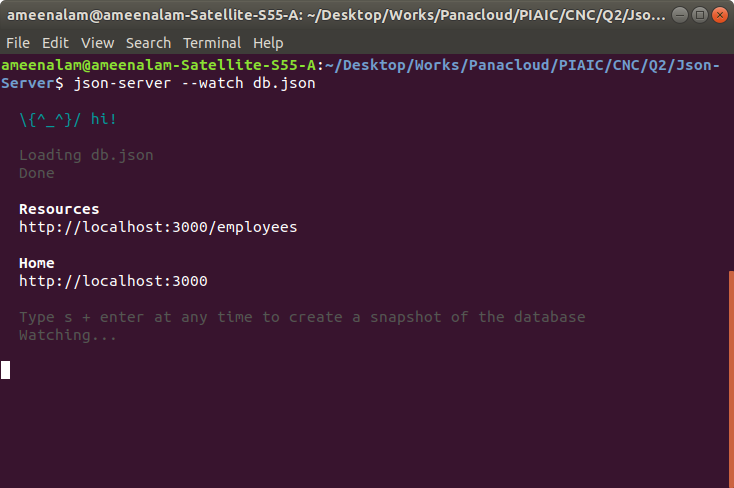

# JSON-SERVER

JSON Server is a Node Module that you can use to create demo rest json webservice in less than a minute. All you need is a JSON file for sample data.

### json-server npm

```$ npm install -g json-server```

#### Pull App

```$ git clone https://github.com/Ameen-Alam/JSON-Server.git```
```$ cd JSON-Server```

#### Run json-server
Run JSON Server in your local machine

```$ json-server --watch db.json```




# Fetch API in React Hooks

Download this project and try all examples

[Project](https://github.com/Ameen-Alam/PIAIC-React-Assignment/blob/master/Starter-kit-1/src/component/about/index.js)


[Project README File](https://github.com/Ameen-Alam/PIAIC-React-Assignment/blob/master/README.md)